<div align="right">
  <a href="./README.md">🇪🇸 Español</a> | <b>🇺🇸 English</b>
</div>

<div align="center">

# 🐧 Rookie Linux Develop

### *Your first Linux system, ready for programming from the first boot.*


</div>

---

## 📸 Screenshots

<div align="center">

<table>
  <tr>
    <td align="center">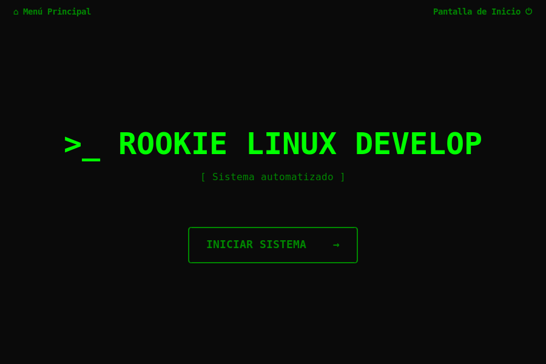<br/><sub><b>System Welcome</b></sub></td>
    <td align="center">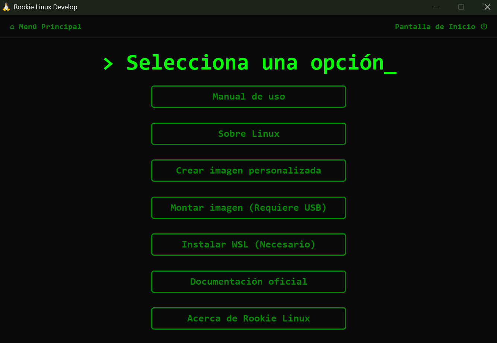<br/><sub><b>Main Menu</b></sub></td>
  </tr>
  <tr>
    <td align="center"><br/><sub><b>Distro Selection</b></sub></td>
    <td align="center">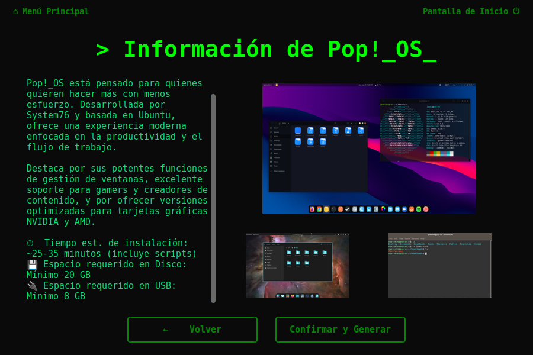<br/><sub><b>Distro Details</b></sub></td>
  </tr>
  <tr>
    <td align="center">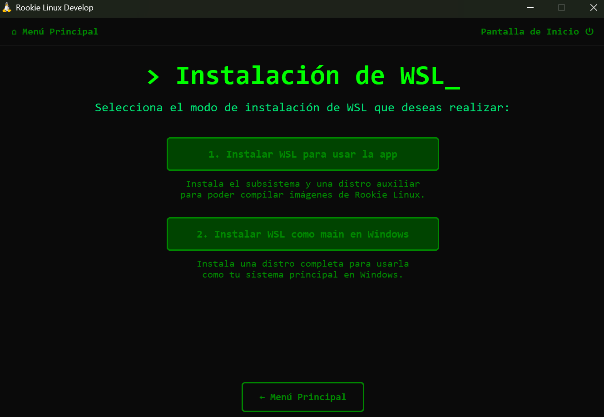<br/><sub><b>WSL Mode Selection</b></sub></td>
    <td align="center">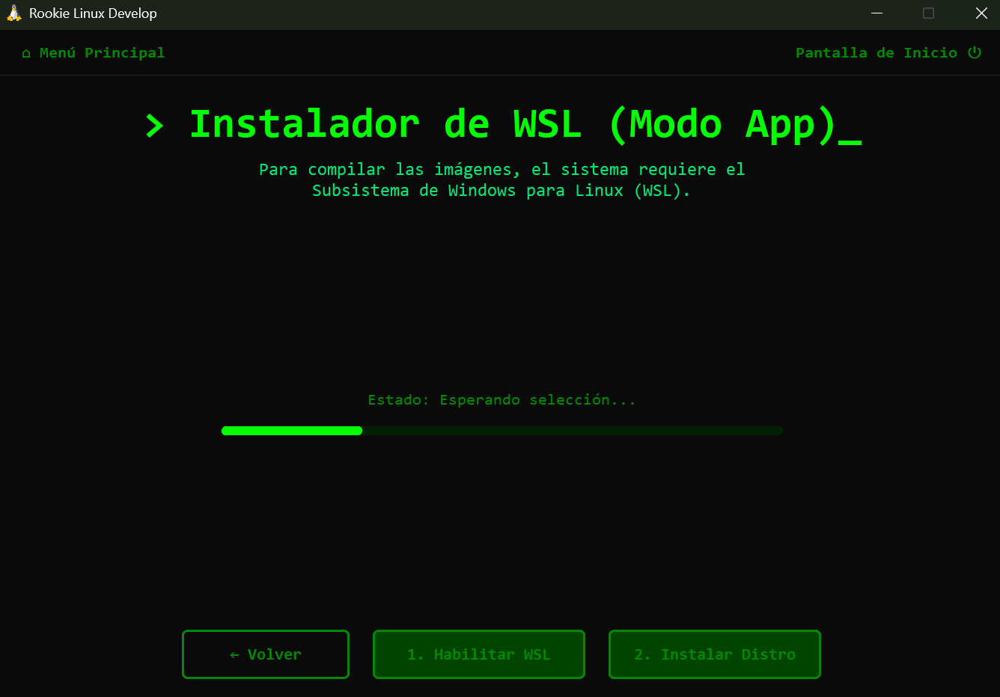<br/><sub><b>WSL Installer (App Mode)</b></sub></td>
  </tr>
  <tr>
    <td align="center">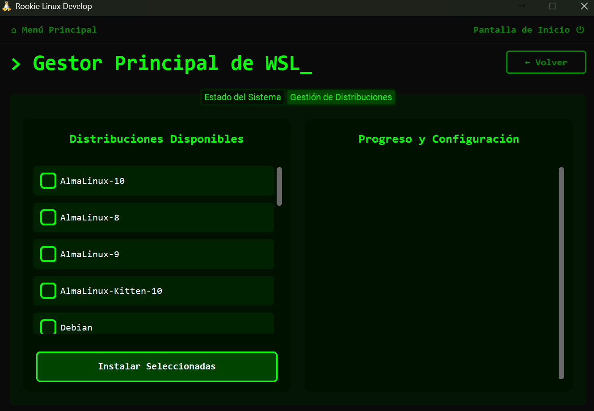<br/><sub><b>WSL Dashboard (Main Mode)</b></sub></td>
    <td align="center">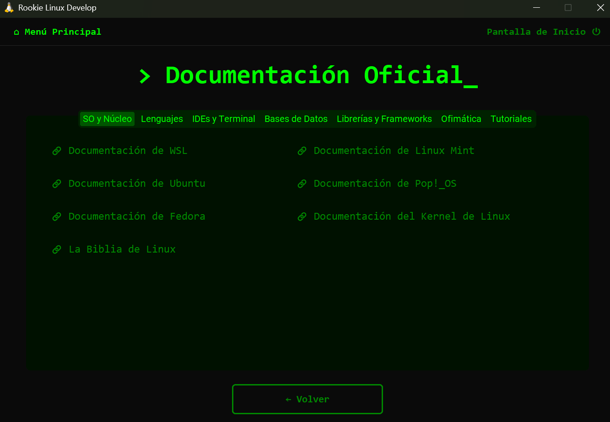<br/><sub><b>Integrated Documentation</b></sub></td>
  </tr>
  <tr>
    <td align="center">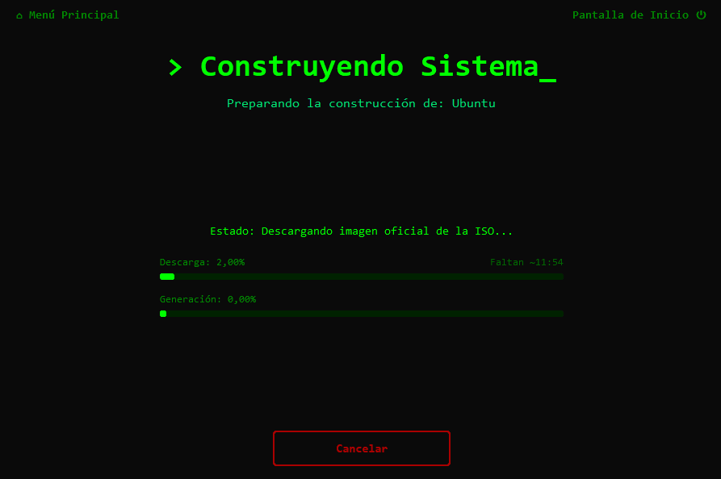<br/><sub><b>ISO Download</b></sub></td>
    <td align="center">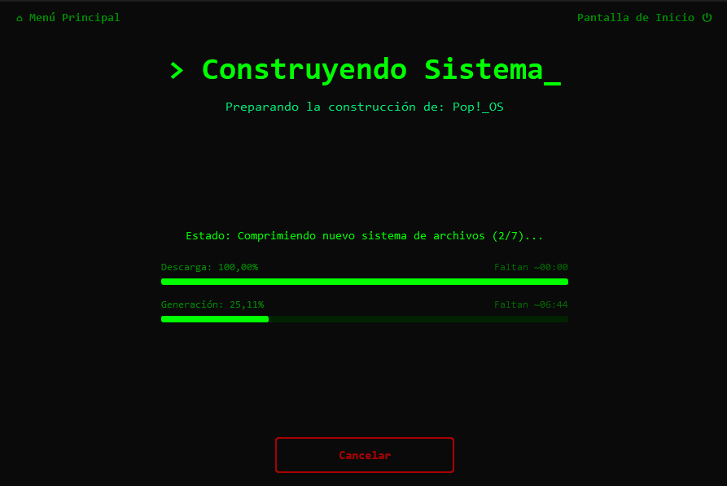<br/><sub><b>ISO Packaging</b></sub></td>
  </tr>
  <tr>
    <td align="center"><br/><sub><b>USB Flasher</b></sub></td>
    <td align="center">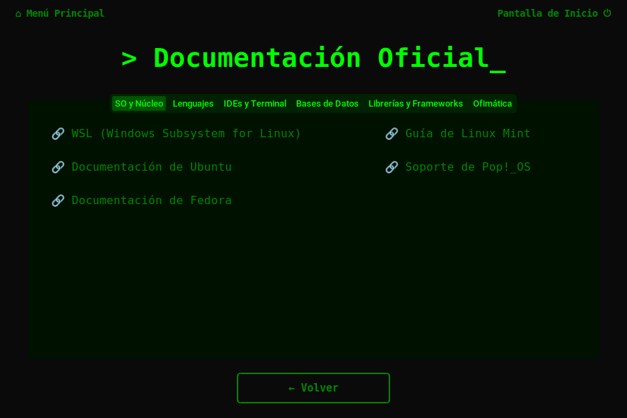<br/><sub><b>Flashing in Progress</b></sub></td>
  </tr>
  <tr>
    <td align="center" colspan="2">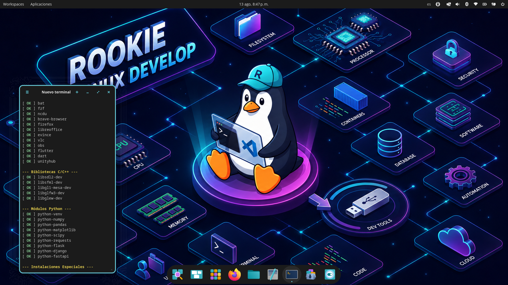<br/><sub><b>Result: Custom Distro</b></sub></td>
  </tr>
</table>

</div>

---

## 🎯 What is this project?

**Rookie Linux Develop** is a desktop application designed to eliminate the biggest barrier facing any developer who wants to switch to Linux: *setting up the environment from scratch*.

With a couple of clicks, the tool downloads an official Linux distribution, automatically injects your complete development stack (languages, IDEs, databases, Docker, Git...) and generates a ready-to-install ISO. The first time you boot the system, everything is already configured.

> **No manual commands. No endless configuration. Ready to program from the first boot.**

---

## ✨ Main Features

- 🏗️ **Custom and unattended ISO creation** — Generates bootable images of Ubuntu, Linux Mint, Pop!_OS, or Fedora with your entire stack pre-configured.
- 💾 **Integrated USB flashing** — Writes the ISO directly to your USB drive from the same application (Windows and Linux).
- 🛠️ **Automated development environment installation** — Automatically installs on the first boot: languages (C/C++, Java, Python, Node.js, .NET, Dart/Flutter), IDEs (VSCode, IntelliJ IDEA), databases (PostgreSQL, SQLite, DBeaver), Docker, Git, Zsh, and much more.
- 📚 **Interactive educational modules** — Built-in guides on Dual Boot, Virtual Machines, Clean Installation, and BitLocker.
- 🖥️ **Modern terminal-style interface** — Minimalist and dark GUI built with CustomTkinter.
- 🪟 **Cross-platform** — Run the tool from Windows (via WSL) or directly on Linux.
- 📖 **Technical links documentation** — Library of links to official documentation for languages, frameworks, IDEs, and databases.

---

## 📦 What software is installed?

Rookie Linux Develop automatically installs and configures over 40 essential development tools, libraries, and applications. 
If you want to see the complete list of everything that is injected into your system, visit the **[Script Catalog (Installed Software)](docs/en/reference/script-catalog.md)** in our documentation.

---

## 🐧 Supported Distributions

| Distribution | Version | Status | Installer |
|---|---|---|---|
| **Ubuntu** | 24.04 LTS | ✅ Stable | Cloud-Init (Subiquity) |
| **Linux Mint** | 22.1 Cinnamon | ✅ Stable | preseed (Ubiquity) |
| **Pop!_OS** | 24.04 (Generic / NVIDIA) | ✅ Stable | Cloud-Init |
| **Fedora** | 41 Workstation | 🚧 In Development | Kickstart (Anaconda) |

---

## 🚀 Download and Execution (For users)

The easiest way to use the tool without programming knowledge is by using the pre-compiled executables.

### 1. Basic Requirements
- **Windows:** WSL installed and enabled (the app itself guides you and lets you install it with one click).
- **Disk space:** You will need ~15 GB of temporary free space to download and generate the new ISO image.

### 2. Download the application
Download the package from the **Releases** tab on GitHub or go to the `app release/` folder in the source code:

```
app release/
├── Rookie Linux Develop Linux.rar   ← For Linux
└── Rookie Linux Develop Win x64.rar ← For Windows
```

### 3. Run
Unzip the file and run the `Rookie-Linux-Builder` binary directly (no installation required).

> 🛡️ **Note for Windows users:** Windows Defender or SmartScreen may block the application as it is from an unknown origin (not being commercially signed). The application is 100% safe; if this happens, click on **"More info"** and then **"Run anyway"**. In some cases, it may be necessary to disable "Smart App Control" in Windows Defender.

---

## ⚡ Quick Start Guide

```
Step 1 → Open the application and go to "Create ISO image"
         │
         ▼
Step 2 → Select your favorite distribution
         (Ubuntu / Linux Mint / Pop!_OS / Fedora)
         │
         ▼
Step 3 → Confirm and click "Generate ISO"
         The app will download the official ISO and automatically
         inject your development environment.
         │
         ▼
Step 4 → Connect your USB and go to "Mount image on USB"
         The app will write the ISO to your pendrive.
         You can now install Linux from it!
```

> 💡 **Tip:** The first boot of the installed system will take a few minutes while all tools are automatically installed. This only happens once.

---

## ⚠️ Known Issues and Notes

- **Inconsistent Progress Bar Percentages:** Because the tool reads and interprets real-time text output (`stdout`) from multiple background subprocesses (such as `xorriso`, `wget`, or WSL installations), it is possible that **the visual percentage may temporarily decrease** or "jump" erratically. This is merely a graphical anomaly; the background process continues to work correctly and safely.

---

## 🛠️ For Developers (Source Code)

If you want to modify the application, contribute to the code, or simply run it natively with Python:

### Prerequisites
| Requirement | Minimum Version |
|---|---|
| Python | 3.10+ |
| Tkinter | Included with Python (`python3-tk` on Linux) |
| pip | Included with Python |

### 1. Clone the repository
```bash
git clone https://github.com/your-username/Rookie-Linux-Develop.git
cd Rookie-Linux-Develop
```

### 2. Install dependencies
```bash
pip install customtkinter pillow rich
```

### 3. Run the application
```bash
python3 frontend/main.py
```
> ⚠️ **Important:** Always run from the project root (`Rookie-Linux-Develop/`), never from inside the `frontend/` folder.

### 📦 Note about the compiled executable size (Linux)
If you run the scripts in the `compile/` folder to generate your own binary with PyInstaller on Linux, you will notice that the resulting size is around **500 MB**. 
This is because PyInstaller, for safety and portability, automatically bundles the Python interpreter, `customtkinter` assets, and **all dynamic system libraries (.so)** (like X11, Wayland, Tcl/Tk, Cairo, Pango, libstdc++) needed to render graphical interfaces. This ensures the application can run properly on any distribution (Fedora, Arch, Mint) without the user missing dependencies.

---

## 📚 Technical Documentation

Check the [`docs/en/`](./docs/en/README.md) folder for the complete project documentation:

| Section | Description |
|---|---|
| [Backend Architecture](./docs/en/architecture/BACKEND_ARCHITECTURE.md) | How the Bash scripts and build system work |
| [Frontend Architecture](./docs/en/architecture/frontend-architecture.md) | Screen system with CustomTkinter |
| [ISO Creation Flow](./docs/en/architecture/iso-creation-flow.md) | How preseed/kickstart is injected |
| [Development Environment](./docs/en/getting-started/development-environment.md) | How to set up the project locally |
| [Compilation](./docs/en/getting-started/compilation.md) | How to generate executables with PyInstaller |
| [Script Catalog](./docs/en/reference/script-catalog.md) | All installable software |
| [Supported Distributions](./docs/en/reference/supported-distros.md) | Technical details of each distro |

---

## 🤝 How to contribute

Contributions are welcome! Here are the easiest ways to start:

### ➕ Add a new development tool

1. Create or edit a `.sh` script in the `scripts/` folder according to the category:
   - `scripts/languages/` — Languages and compilers
   - `scripts/ide_tools/` — IDEs and editors
   - `scripts/system_utils/` — System utilities
2. Register it in `scripts/install.sh`.
3. Update the catalog in [`docs/en/reference/script-catalog.md`](./docs/en/reference/script-catalog.md).

> 📖 Detailed guide: [How to add scripts](./docs/en/guides/adding-scripts.md)

### 🐧 Add support for a new distribution

1. Create the template folder in `builder/templates/<distro>/`.
2. Add the download logic in `builder/download_iso.sh`.
3. Add the build logic in `builder/build_iso.sh`.
4. Register the distro in the frontend screens.

> 📖 Detailed guide: [How to add a distro](./docs/en/guides/adding-distro.md)

---

## 🤖 AI Assistance

This project was developed with the assistance of **Google Gemini** in:
- The design and logic of the **frontend** (Python/CustomTkinter).
- Parts of the **source code** (backend, build scripts).
- The **technical documentation** (structure and writing).

The original ideas, goals, and direction of the project are authored by the developer.

---

## 📄 License 

### License

This project is distributed under the **MIT** license. Check the [`docs/en/LICENSE.md`](./docs/en/LICENSE.md) file for more details.

### Technologies used

| Technology | Purpose |
|---|---|
| [CustomTkinter](https://github.com/TomSchimansky/CustomTkinter) | Modern GUI for Python |
| [Pillow (PIL)](https://python-pillow.org/) | Image processing |
| [PyInstaller](https://pyinstaller.org/) | Application packaging |
| [xorriso](https://www.gnu.org/software/xorriso/) | ISO manipulation and repackaging |
| [squashfs-tools](https://github.com/plougher/squashfs-tools) | Filesystem unpacking |
| [Cloud-Init](https://cloud-init.io/) | Installer automation (Ubuntu/Pop!_OS) |
| [Kickstart](https://pykickstart.readthedocs.io/) | Installer automation (Fedora) |

---
