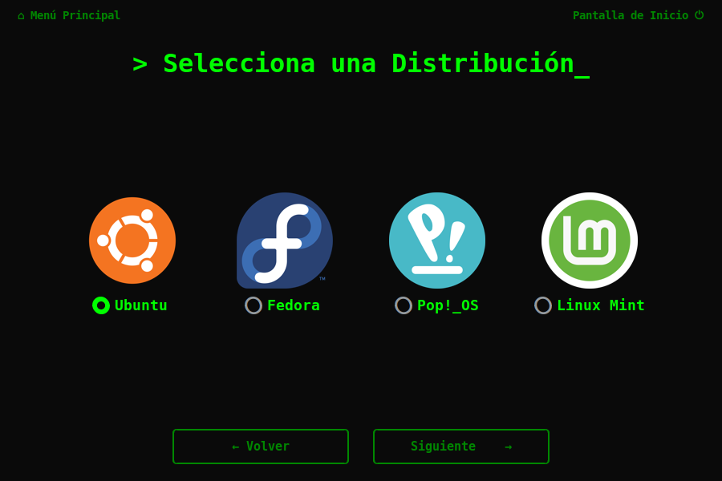
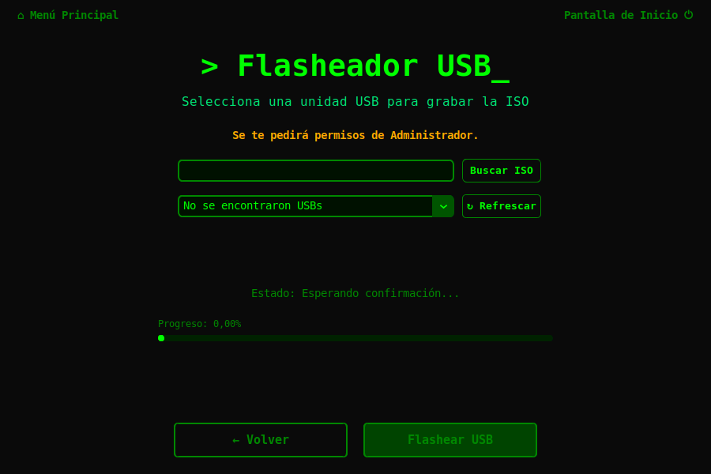

<div align="right">
  <b>🇪🇸 Español</b> | <a href="./README.en.md">🇺🇸 English</a>
</div>

<div align="center">

# 🐧 Rookie Linux Develop

### *Tu primer sistema Linux, listo para programar desde el primer arranque.*


</div>

---

## 📸 Capturas de pantalla

<div align="center">

<table>
  <tr>
    <td align="center"><br/><sub><b>Pantalla de inicio</b></sub></td>
    <td align="center"><br/><sub><b>Selección de distribución</b></sub></td>
  </tr>
  <tr>
    <td align="center"><br/><sub><b>Información de la distribución</b></sub></td>
    <td align="center"><br/><sub><b>USB Flasher</b></sub></td>
  </tr>
  <tr>
    <td align="center" colspan="2"><br/><sub><b>Documentación</b></sub></td>
  </tr>
</table>

</div>

---

## 🎯 ¿Qué es este proyecto?

**Rookie Linux Develop** es una aplicación de escritorio diseñada para eliminar la barrera más grande que enfrenta cualquier desarrollador que quiere pasarse a Linux: *configurar el entorno desde cero*.

Con un par de clics, la herramienta descarga una distribución oficial de Linux, le inyecta automáticamente tu stack de desarrollo completo (lenguajes, IDEs, bases de datos, Docker, Git…) y genera una ISO lista para instalar. La primera vez que arrancas el sistema, todo ya está configurado.

> **Sin comandos manuales. Sin configuración interminable. Listo para programar desde el primer arranque.**

---

## ✨ Características principales

- 🏗️ **Creación de ISOs personalizadas y desatendidas** — Genera imágenes booteable de Ubuntu, Linux Mint, Pop!_OS o Fedora con todo tu stack preconfigurado.
- 💾 **Flasheo integrado de USB** — Escribe la ISO directamente en tu memoria USB desde la misma aplicación (Windows y Linux).
- 🛠️ **Instalación automatizada del entorno de desarrollo** — Instala automáticamente en el primer arranque: lenguajes (C/C++, Java, Python, Node.js, .NET, Dart/Flutter), IDEs (VSCode, IntelliJ IDEA), bases de datos (PostgreSQL, SQLite, DBeaver), Docker, Git, Zsh y mucho más.
- 📚 **Módulos educativos interactivos** — Guías integradas sobre Dual Boot, Máquinas Virtuales, Instalación Limpia y BitLocker.
- 🖥️ **Interfaz moderna estilo terminal** — GUI minimalista y oscura construida con CustomTkinter.
- 🪟 **Multiplataforma** — Ejecuta la herramienta desde Windows (vía WSL) o directamente en Linux.
- 📖 **Documentación de enlaces técnicos** — Biblioteca de links a documentación oficial de lenguajes, frameworks, IDEs y bases de datos.

---

## 📦 ¿Qué software se instala?

Rookie Linux Develop instala y configura automáticamente más de 40 herramientas, librerías y aplicaciones esenciales para el desarrollo. 
Si deseas ver la lista completa de todo lo que se inyecta en tu sistema, visita el **[Catálogo de Scripts (Software Instalado)](docs/es/referencia/catalogo-de-scripts.md)** en nuestra documentación.

---

## 🐧 Distribuciones soportadas

| Distribución | Versión | Estado | Instalador |
|---|---|---|---|
| **Ubuntu** | 24.04 LTS | ✅ Estable | Cloud-Init (Subiquity) |
| **Linux Mint** | 22.1 Cinnamon | ✅ Estable | preseed (Ubiquity) |
| **Pop!_OS** | 24.04 (Generic / NVIDIA) | ✅ Estable | Cloud-Init |
| **Fedora** | 41 Workstation | 🚧 En desarrollo | Kickstart (Anaconda) |

---

## 📋 Requisitos previos

### Para ejecutar la aplicación (GUI)

| Requisito | Versión mínima |
|---|---|
| Python | 3.10+ |
| Tkinter | Incluido con Python (`python3-tk`) |
| pip | Incluido con Python |

### Para construir ISOs

| Plataforma | Requisito adicional |
|---|---|
| **Linux** | `xorriso`, `squashfs-tools` (`sudo apt install xorriso squashfs-tools`) |
| **Windows** | WSL instalado y habilitado (la app lo guía) |

### Espacio en disco recomendado

- **Descarga de ISO**: ~3–6 GB por distribución.
- **Construcción de la ISO personalizada**: ~10–15 GB temporales en `/tmp`.
- **ISO resultante**: ~3–5 GB en la carpeta `output/`.

---

## 🚀 Instalación y ejecución

### 1. Clona el repositorio

```bash
git clone https://github.com/tu-usuario/Rookie-Linux-Develop.git
cd Rookie-Linux-Develop
```

### 2. Instala las dependencias Python

```bash
pip install customtkinter pillow
```

> En Linux, si no tienes Tkinter: `sudo apt install python3-tk`

### 3. Ejecuta la aplicación

```bash
python3 frontend/main.py
```

> ⚠️ **Importante:** Ejecuta siempre desde la raíz del proyecto (`Rookie-Linux-Develop/`), no desde dentro de `frontend/`.

### Usando los ejecutables compilados (sin Python)

Descarga el paquete de la carpeta `app release/` correspondiente a tu sistema:

```
app release/
├── Rookie Linux Develop Linux.rar   ← Para Linux
└── Rookie Linux Develop Win x64.rar ← Para Windows
```

Descomprime y ejecuta el binario `Rookie-Linux-Builder` directamente.

> 🛡️ **Nota para usuarios de Windows:** Windows Defender o SmartScreen pueden bloquear la aplicación por ser de origen desconocido (al no estar firmada comercialmente). La aplicación es 100% segura; si esto ocurre, haz clic en **"Más información"** y luego en **"Ejecutar de todas formas"**. En algunos casos, puede ser necesario desactivar el "Control inteligente de aplicaciones" de Windows Defender.

---

## ⚡ Guía rápida de uso

```
Paso 1 → Abre la aplicación y ve a "Crear imagen ISO"
         │
         ▼
Paso 2 → Selecciona tu distribución favorita
         (Ubuntu / Linux Mint / Pop!_OS / Fedora)
         │
         ▼
Paso 3 → Confirma y haz clic en "Generar ISO"
         La app descargará la ISO oficial e inyectará
         automáticamente tu entorno de desarrollo.
         │
         ▼
Paso 4 → Conecta tu USB y ve a "Montar imagen en USB"
         La app escribirá la ISO en tu pendrive.
         ¡Ya puedes instalar Linux desde él!
```

> 💡 **Tip:** El primer arranque del sistema instalado tomará unos minutos mientras se instalan todas las herramientas automáticamente. Solo ocurre una vez.

---

## 📚 Documentación técnica

Consulta la carpeta [`docs/es/`](./docs/es/README.md) para la documentación completa del proyecto:

| Sección | Descripción |
|---|---|
| [Arquitectura del backend](./docs/es/arquitectura/ARQUITECTURA_BACKEND.md) | Cómo funcionan los scripts Bash y el sistema de construcción |
| [Arquitectura del frontend](./docs/es/arquitectura/arquitectura-frontend.md) | Sistema de pantallas con CustomTkinter |
| [Flujo de creación de ISO](./docs/es/arquitectura/flujo-creacion-iso.md) | Cómo se inyecta preseed/kickstart |
| [Entorno de desarrollo](./docs/es/primeros-pasos/entorno-de-desarrollo.md) | Cómo levantar el proyecto localmente |
| [Compilación](./docs/es/primeros-pasos/compilacion.md) | Cómo generar los ejecutables con PyInstaller |
| [Catálogo de scripts](./docs/es/referencia/catalogo-de-scripts.md) | Todo el software instalable |
| [Distribuciones soportadas](./docs/es/referencia/distros-soportadas.md) | Detalles técnicos de cada distro |

---

## 🤝 Cómo contribuir

¡Las contribuciones son bienvenidas! Aquí los puntos más fáciles para empezar:

### ➕ Agregar una nueva herramienta de desarrollo

1. Crea o edita un script `.sh` en la carpeta `scripts/` según la categoría:
   - `scripts/languages/` — Lenguajes y compiladores
   - `scripts/ide_tools/` — IDEs y editores
   - `scripts/system_utils/` — Utilidades del sistema
2. Regístralo en `scripts/install.sh`.
3. Actualiza el catálogo en [`docs/es/referencia/catalogo-de-scripts.md`](./docs/es/referencia/catalogo-de-scripts.md).

> 📖 Guía detallada: [Cómo agregar scripts](./docs/es/guias/como-agregar-scripts.md)

### 🐧 Agregar soporte a una nueva distribución

1. Crea la carpeta de plantillas en `builder/templates/<distro>/`.
2. Añade la lógica de descarga en `builder/download_iso.sh`.
3. Añade la lógica de construcción en `builder/build_iso.sh`.
4. Registra la distro en las pantallas del frontend.

> 📖 Guía detallada: [Cómo agregar una distro](./docs/es/guias/como-agregar-una-distro.md)

---

## 🤖 Asistencia de IA

Este proyecto fue desarrollado con asistencia de **Google Gemini** en:
- El diseño y lógica del **frontend** (Python/CustomTkinter).
- Partes del **código fuente** (backend, scripts de construcción).
- La **documentación técnica** (estructura y redacción).

Las ideas originales, objetivos y dirección del proyecto son autoría del desarrollador.

---

## 📄 Licencia

### Licencia

Este proyecto se distribuye bajo la licencia **MIT**. Consulta el archivo [`docs/es/LICENCIA.md`](./docs/es/LICENCIA.md) para más detalles.

### Tecnologías utilizadas

| Tecnología | Propósito |
|---|---|
| [CustomTkinter](https://github.com/TomSchimansky/CustomTkinter) | GUI moderna para Python |
| [Pillow (PIL)](https://python-pillow.org/) | Procesamiento de imágenes |
| [PyInstaller](https://pyinstaller.org/) | Empaquetado de la aplicación |
| [xorriso](https://www.gnu.org/software/xorriso/) | Manipulación y reempaquetado de ISOs |
| [squashfs-tools](https://github.com/plougher/squashfs-tools) | Desempaquetado del sistema de archivos |
| [Cloud-Init](https://cloud-init.io/) | Automatización de instaladores (Ubuntu/Pop!_OS) |
| [Kickstart](https://pykickstart.readthedocs.io/) | Automatización de instaladores (Fedora) |

---


